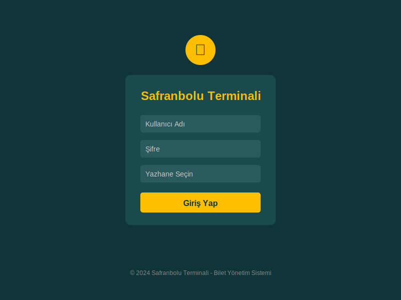
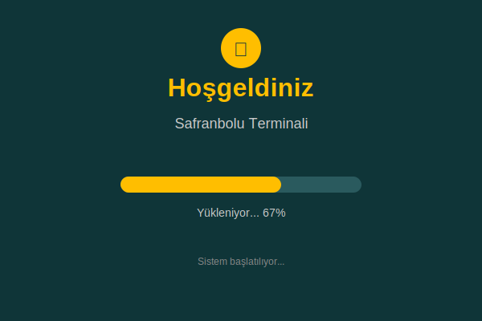
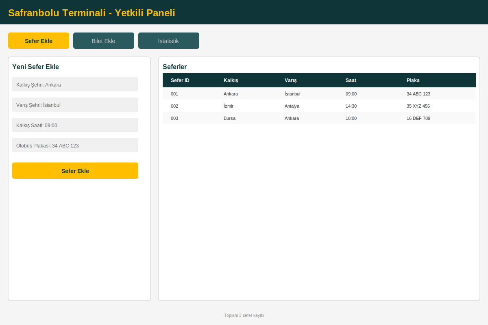
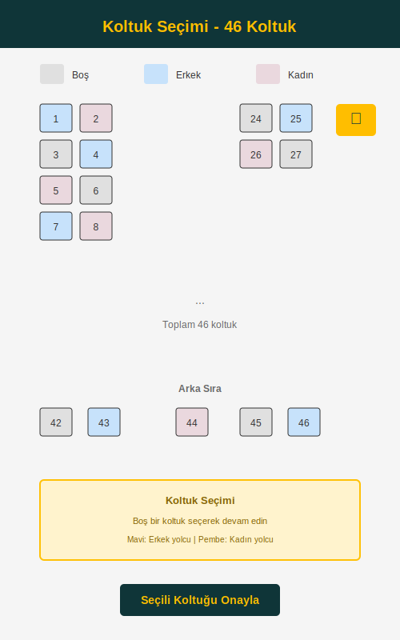
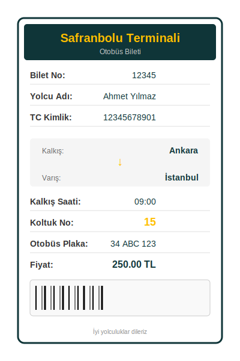
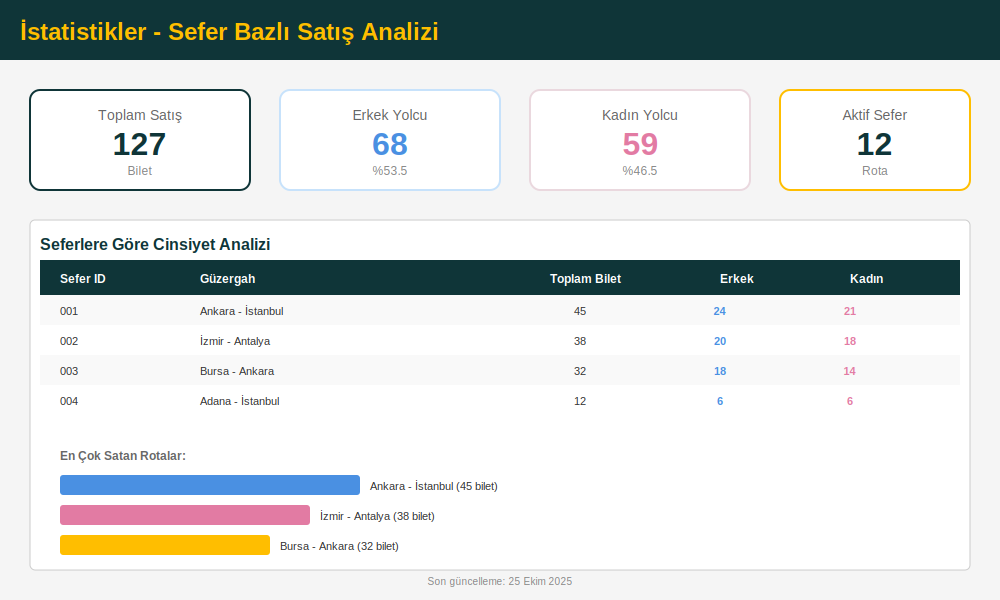

# Safranbolu Terminali - Otobüs Bilet Yönetim Sistemi

Modern ve kullanıcı dostu bir otobüs terminali bilet yönetim sistemi. JavaFX ile geliştirilmiş masaüstü uygulaması.

## İçindekiler

- [Özellikler](#özellikler)
- [Teknolojiler](#teknolojiler)
- [Sistem Gereksinimleri](#sistem-gereksinimleri)
- [Kurulum](#kurulum)
- [Veritabanı Yapılandırması](#veritabanı-yapılandırması)
- [Kullanım](#kullanım)
- [Ekran Görüntüleri](#ekran-görüntüleri)
- [Proje Yapısı](#proje-yapısı)
- [Lisans](#lisans)

## Özellikler

### 🎫 Bilet Yönetimi
- Otobüs bileti oluşturma ve satış
- Bilet görüntüleme ve silme
- Barkodlu bilet çıktısı
- Koltuk numarası seçimi

### 🚌 Sefer Yönetimi
- Sefer ekleme ve silme
- Kalkış ve varış şehirleri yönetimi
- Kalkış saati belirleme
- Otobüs ve şoför ataması

### 👥 Yolcu Yönetimi
- Yolcu kaydı oluşturma
- TC kimlik numarası ile doğrulama
- Cinsiyet ve yaş bilgisi
- İletişim bilgileri

### 💺 İnteraktif Koltuk Seçimi
- 40 ve 46 koltuk kapasiteli otobüs desteği
- Cinsiyete göre renkli koltuk gösterimi
  - Erkek yolcular için mavi
  - Kadın yolcular için pembe
- Dolu koltuk kontrolü
- Görsel koltuk haritası

### 📊 İstatistikler
- Seferlere göre satış analizi
- Cinsiyete göre bilet dağılımı
- Toplam satış raporları
- Detaylı analiz ekranı

### 🔐 Güvenlik
- Kullanıcı girişi sistemi
- Yetkili personel yönetimi
- Çoklu yazhane desteği (Yazhane 1, Yazhane 2)

## Teknolojiler

- **Programlama Dili:** Java 17
- **GUI Framework:** JavaFX 17.0.2
- **Veritabanı:** Microsoft SQL Server
- **Build Tool:** Maven
- **Test Framework:** JUnit 5.9.1
- **UI Markup:** FXML
- **Stil:** CSS

## Sistem Gereksinimleri

- Java Development Kit (JDK) 17 veya üzeri
- Microsoft SQL Server 2019 veya üzeri
- Maven 3.6 veya üzeri
- Minimum 4GB RAM
- Windows/Linux/MacOS işletim sistemi

## Kurulum

### 1. Projeyi Klonlayın

```bash
git clone https://github.com/yourusername/Bus-Terminal.git
cd Bus-Terminal
```

### 2. Maven Bağımlılıklarını Yükleyin

```bash
./mvnw clean install
```

veya Windows için:

```bash
mvnw.cmd clean install
```

### 3. Veritabanını Yapılandırın

Veritabanı yapılandırma adımları için [Veritabanı Yapılandırması](#veritabanı-yapılandırması) bölümüne bakın.

### 4. Uygulamayı Çalıştırın

```bash
./mvnw javafx:run
```

veya Windows için:

```bash
mvnw.cmd javafx:run
```

## Veritabanı Yapılandırması

### 1. SQL Server Kurulumu

Microsoft SQL Server'ı kurun ve çalıştırın.

### 2. Veritabanı Oluşturma

```sql
CREATE DATABASE SafranboluTerminali;
```

### 3. Tablolar

Aşağıdaki tabloları oluşturun:

```sql
-- Yetkili Tablosu
CREATE TABLE Yetkili (
    yetkiliID INT PRIMARY KEY IDENTITY(1,1),
    KullaniciAdi NVARCHAR(50) NOT NULL,
    KullaniciSifre NVARCHAR(50) NOT NULL,
    yetkiliAdi NVARCHAR(50),
    yetkiliSoyadi NVARCHAR(50),
    yazhaneID INT
);

-- Otobüs Şirketi Tablosu
CREATE TABLE OtobusSirketi (
    otobusSirketID INT PRIMARY KEY IDENTITY(1,1),
    otobusSirketAd NVARCHAR(100) NOT NULL
);

-- Otobüs Tablosu
CREATE TABLE Otobus (
    otobusPlaka NVARCHAR(20) PRIMARY KEY,
    otobusKapasite INT NOT NULL,
    otobusSirketID INT FOREIGN KEY REFERENCES OtobusSirketi(otobusSirketID)
);

-- Şoför Tablosu
CREATE TABLE Sofor (
    soforID INT PRIMARY KEY IDENTITY(1,1),
    soforAd NVARCHAR(50),
    soforSoyad NVARCHAR(50)
);

-- Sefer Tablosu
CREATE TABLE Sefer (
    seferID INT PRIMARY KEY IDENTITY(1,1),
    otobusPlaka NVARCHAR(20) FOREIGN KEY REFERENCES Otobus(otobusPlaka),
    kalkisSaat NVARCHAR(10),
    kalkisSehir NVARCHAR(50),
    varisSehir NVARCHAR(50),
    soforID INT FOREIGN KEY REFERENCES Sofor(soforID)
);

-- Yolcu Tablosu
CREATE TABLE Yolcu (
    yolcuTC NVARCHAR(11) PRIMARY KEY,
    yolcuAd NVARCHAR(50),
    yolcuSoyad NVARCHAR(50),
    yolcuCinsiyet NVARCHAR(10),
    yolcuYas INT,
    yolcuTel NVARCHAR(15),
    otobusPlaka NVARCHAR(20) FOREIGN KEY REFERENCES Otobus(otobusPlaka)
);

-- Bilet Tablosu
CREATE TABLE Bilet (
    biletID INT PRIMARY KEY,
    yolcuTC NVARCHAR(11) FOREIGN KEY REFERENCES Yolcu(yolcuTC),
    seferID INT FOREIGN KEY REFERENCES Sefer(seferID),
    biletFiyat DECIMAL(10,2),
    koltukNumarasi INT
);

-- İstatistik View
CREATE VIEW v_SatilanBiletCinsiyetAnalizi AS
SELECT
    s.seferID,
    s.kalkisSehir + ' - ' + s.varisSehir AS Güzergah,
    COUNT(b.biletID) AS ToplamBilet,
    SUM(CASE WHEN y.yolcuCinsiyet = 'Erkek' THEN 1 ELSE 0 END) AS ErkekBilet,
    SUM(CASE WHEN y.yolcuCinsiyet = 'Kadın' THEN 1 ELSE 0 END) AS KadinBilet
FROM Bilet b
INNER JOIN Yolcu y ON b.yolcuTC = y.yolcuTC
INNER JOIN Sefer s ON b.seferID = s.seferID
GROUP BY s.seferID, s.kalkisSehir, s.varisSehir;
```

### 4. Stored Procedure

```sql
CREATE PROCEDURE getSeferVeSofor
AS
BEGIN
    SELECT
        s.seferID,
        s.otobusPlaka,
        s.kalkisSaat,
        s.kalkisSehir,
        s.varisSehir,
        sf.soforAd + ' ' + sf.soforSoyad AS soforAdSoyad
    FROM Sefer s
    LEFT JOIN Sofor sf ON s.soforID = sf.soforID;
END;
```

### 5. Bağlantı Ayarları

`src/main/java/com/example/safranboluterminali/DatabaseConnector.java` dosyasındaki bağlantı bilgilerini güncelleyin:

```java
String connectionUrl = "jdbc:sqlserver://localhost:1433;" +
    "databaseName=SafranboluTerminali;" +
    "user=SA;" +
    "password=YourStrongPassword;" +
    "encrypt=true;" +
    "trustServerCertificate=true";
```

**Güvenlik Notu:** Üretim ortamında şifreleri kod içinde saklamayın. Ortam değişkenleri veya yapılandırma dosyaları kullanın.

## Kullanım

### Giriş Yapma

1. Uygulamayı başlatın
2. Kullanıcı adı ve şifrenizi girin
3. Yazhane numaranızı seçin (Yazhane 1 veya Yazhane 2)
4. "Giriş Yap" butonuna tıklayın

### Sefer Ekleme

1. Ana ekranda "Sefer Ekle" sekmesine gidin
2. Kalkış şehrini seçin
3. Varış şehrini seçin
4. Kalkış saatini girin
5. Otobüs plakasını seçin
6. "Sefer Ekle" butonuna tıklayın

### Bilet Satışı

1. "Bilet Ekle" sekmesine gidin
2. Yolcu bilgilerini girin (TC, Ad, Soyad, Cinsiyet, Yaş, Telefon)
3. Sefer seçin
4. Bilet fiyatını girin
5. "Koltuk Seç" butonuna tıklayın
6. Açılan pencereden boş bir koltuk seçin
7. "Bilet Ekle" butonuna tıklayın
8. Bilet ekranı otomatik olarak açılacaktır

### İstatistik Görüntüleme

1. "İstatistik" sekmesine gidin
2. Seferlere göre cinsiyet bazlı satış istatistiklerini görüntüleyin

## Ekran Görüntüleri
Ekran görüntüleri temsilidir. Özellikleri ve sistemi görüntülemek için örnek oluşturulmuştur. 

### Giriş Ekranı


Modern ve minimalist giriş ekranı. Kullanıcı adı, şifre ve yazhane seçimi.

### Karşılama Ekranı


Yükleme ilerlemesi ile karşılama ekranı.

### Ana Panel


Sefer, yolcu ve bilet yönetimi için ana kontrol paneli.

### Koltuk Seçimi (40 Koltuk)


40 koltuk kapasiteli otobüs için interaktif koltuk seçim ekranı.

### Koltuk Seçimi (46 Koltuk)


46 koltuk kapasiteli otobüs için interaktif koltuk seçim ekranı.

### Bilet Görüntüleme


Oluşturulan biletin detaylı görünümü ve barkod.

### İstatistik Paneli


Seferlere göre cinsiyet bazlı satış analizleri.

## Proje Yapısı

```
Bus-Terminal/
├── src/
│   ├── main/
│   │   ├── java/com/example/safranboluterminali/
│   │   │   ├── Main.java                        # Uygulama giriş noktası
│   │   │   ├── BiletEkraniController.java       # Bilet görüntüleme kontrolcüsü
│   │   │   ├── GirisController.java             # Giriş kontrolcüsü
│   │   │   ├── KirkAltiKoltukController.java    # 46 koltuk kontrolcüsü
│   │   │   ├── KirkKoltukController.java        # 40 koltuk kontrolcüsü
│   │   │   ├── SplashController.java            # Splash screen kontrolcüsü
│   │   │   ├── YetkiliController.java           # Ana panel kontrolcüsü
│   │   │   ├── Bilet.java                       # Bilet veri modeli
│   │   │   ├── Istatistik.java                  # İstatistik veri modeli
│   │   │   ├── Otobus.java                      # Otobüs veri modeli
│   │   │   ├── Sefer.java                       # Sefer veri modeli
│   │   │   ├── Yolcu.java                       # Yolcu veri modeli
│   │   │   └── DatabaseConnector.java           # Veritabanı bağlantı yöneticisi
│   │   └── resources/
│   │       ├── com/example/safranboluterminali/
│   │       │   ├── biletEkrani.fxml             # Bilet ekranı UI
│   │       │   ├── giris-view.fxml              # Giriş ekranı UI
│   │       │   ├── kirkAltiKoltuk-view.fxml     # 40 koltuk UI
│   │       │   ├── kirkKoltuk-view.fxml         # 46 koltuk UI
│   │       │   ├── splash.fxml                  # Splash screen UI
│   │       │   └── yetkili-view.fxml            # Ana panel UI
│   │       ├── css/
│   │       │   └── style.css                    # Uygulama stilleri
│   │       └── Images/
│   │           ├── barkod.png                   # Barkod görseli
│   │           ├── direksiyon.png               # Direksiyon ikonu
│   │           └── giris.jpg                    # Giriş ekranı görseli
│   └── test/
│       └── java/
├── pom.xml                                      # Maven yapılandırması
├── mvnw                                         # Maven wrapper (Unix)
├── mvnw.cmd                                     # Maven wrapper (Windows)
└── README.md                                    # Bu dosya
```

## Önemli Sınıflar

### Controllers (Kontrolcüler)

- **Main.java**: JavaFX uygulamasının başlangıç noktası
- **GirisController.java**: Kullanıcı girişi ve kimlik doğrulama
- **SplashController.java**: Yükleme ekranı animasyonu
- **YetkiliController.java**: Ana yönetim paneli, tüm CRUD işlemleri
- **BiletEkraniController.java**: Bilet görüntüleme ve çıktı
- **KirkKoltukController.java**: 46 koltuklu otobüs seçimi
- **KirkAltiKoltukController.java**: 40 koltuklu otobüs seçimi

### Models (Veri Modelleri)

- **Yolcu.java**: Yolcu bilgileri (TC, Ad, Soyad, Cinsiyet, Yaş, Telefon)
- **Bilet.java**: Bilet bilgileri (ID, Yolcu TC, Sefer ID, Fiyat, Koltuk No)
- **Sefer.java**: Sefer bilgileri (ID, Plaka, Saat, Şehirler, Şoför)
- **Otobus.java**: Otobüs bilgileri (Plaka, Kapasite, Şirket)
- **Istatistik.java**: İstatistik verileri

### Database (Veritabanı)

- **DatabaseConnector.java**: SQL Server bağlantı yönetimi

## Bilinen Sorunlar

- Veritabanı bağlantı bilgileri kod içinde sabit olarak tanımlanmış
- Bazı SQL sorguları parametre kullanmıyor
- Şifre şifreleme mekanizması yok

## Lisans

Bu proje MIT lisansı altında lisanslanmıştır. Detaylar için [LICENSE](LICENSE) dosyasına bakın.


---

**Not:** Bu proje eğitim amaçlı geliştirilmiştir. Üretim ortamında kullanmadan önce güvenlik önlemlerini artırın.
